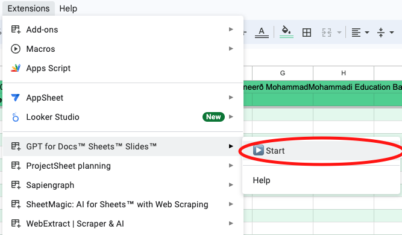
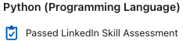
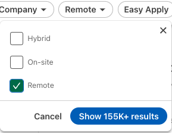
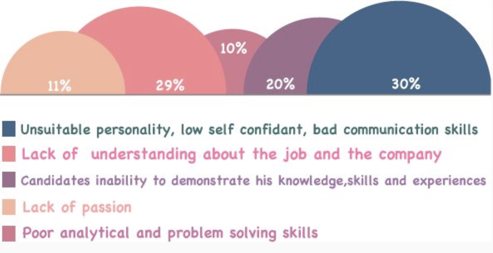

# Get Remote Job Offers - ASAP
I created this guide out of my passion for the developer community. A star 🌟 on this repo would be greatly appreciated 🤗, as it motivates me to dedicate more time to it.

If you have any comments, ideas, or appreciation, please use the [discussions](https://github.com/mohammadi-com/JobNavigator/discussions) tab. This is a continually updated, open source project. Don't hesitate to **clone**, **fork**, and submit **pull requests**!

This guide is designed like a to-do list, so there's no need to read it all at once. In each step, I purposefully suggest only one tool to keep you from wondering what to use. Just follow each step, slaying one dragon at a time, until you land that job offer.

## Steps
<ol>
    <li><a href="#resume-preparation">Resume Prepration</a></li>
    <li><a href="#customized-cover-letter">Customized Cover Letter</a></li>
    <li><a href="#start-applying-for-jobs">Start Applying for Jobs</a>
        <ul>
            <li><a href="#linkedin">LinkedIn</a></li>
            <li><a href="#cord">Cord</a></li>
            <li><a href="#remoteok">RemoteOK</a></li>
            <li><a href="#honeypot">HoneyPot</a></li>
            <li><a href="#glassdoor">Glassdoor</a></li>
            <li><a href="#indeed">Indeed</a></li>
            <li><a href="#weworkremotely">WeWorkRemotely</a></li>
            <li><a href="#wellfound-formerly-angellist">Wellfound (Formerly AngelList)</a></li>
            <li><a href="#otta">Otta</a></li>
            <li><a href="#golangprojects">GolangProjects</a></li>
            <li><a href="#cold-email">Cold Email</a></li>
            <li><a href="#referrals">Referrals</a></li>
        </ul>
    </li>
    <li><a href="#prep-for-interview">Prep for Interview</a>
        <ul>
            <li><a href="#show-dont-tell">Show, Don’t Tell</a></li>
            <li><a href="#star-method-action-verbs">STAR Method (Action Verbs)</a></li>
            <li><a href="#improve-your-english">Improve Your English</a></li>
            <li><a href="#boost-your-confidence">Boost Your Confidence</a></li>
            <li><a href="#practice-with-mock-interviews">Practice with Mock Interviews</a></li>
            <li><a href="#look-presentable">Look Presentable</a></li>
            <li><a href="#be-punctual">Be Punctual</a></li>
            <li><a href="#research-the-job-and-company">Research the Job and Company</a></li>
            <li><a href="#flash-a-smile">Flash a Smile</a></li>
            <li><a href="#send-a-follow-up-email">Send a Follow-Up Email</a></li>
        </ul>
    </li>
    <li><a href="#interview-stages">Interview Stages</a>
        <ul>
            <li><a href="#hr-interview">HR Interview</a></li>
            <li><a href="#technical-interview">Technical Interview</a></li>
            <li><a href="#cultural-fit-interview">Cultural Fit Interview</a></li>
            <li><a href="#interview-postmortem"> Interview Postmortem</a></li>
        </ul>
    </li>
</ol>

## Resume Preparation
First off, it's crucial to read job descriptions carefully and tailor your CV and cover letter to match them. It's completely normal to spend about 30-60 minutes on each job application. Preparing a proper job application takes time. That’s why I often say that applying for jobs is a full-time job in itself! Taking the time to craft your application can significantly increase your chances of getting noticed and ultimately landing an interview.

You can find many [free resume templates here](https://www.latextemplates.com/cat/curricula-vitae). Choose a CV style that you like—I'd suggest going for a one-column layout. If you're familiar with LaTeX, great! If not, you can use [Overleaf's visual editor](https://www.overleaf.com/) to easily create your resume.

It might seem counterintuitive, but it's better to keep your job search focused. For instance, if you know you want to be a back-end engineer specializing in Python, don't apply for every software engineer role out there. By narrowing your focus, you can tailor your resume, LinkedIn, and other profiles to match exactly what you're looking for. This makes you a stronger candidate for the jobs that really matter to you.

Here's a simple way to create your CV:
### Master CV
First, write a detailed CV. Don’t worry about making it short; include everything. For each job you've had, list at least ten things you did. This full version will be your base for making shorter ones tailored to each job.
### Tailored CV
For each job you apply for, pick the top 3-4 most relevant points from your detailed CV and hide the rest (easy to do in LaTeX). This way, you make a CV that highlights what's most important for that job. You can use [JobScan](https://www.jobscan.co/) to check how well your CV matches the job description.

Start with the most important information. If your education is the most relevant, list it first. If your open-source projects are the best match for the job, highlight them at the top. If your experience is the strongest fit, lead with that.

For instance, if you're applying for a remote job with a European company, showcase any experience you have working with Europeans right away. This shows you understand their work culture. If the employer is in the healthcare industry and you have an article on healthcare data analysis, don't bury it on the second page. Put it at the top to grab the recruiter's attention.

**CV Tips**:
- Don’t rely on ChatGPT to write your entire resume. Instead, draft it yourself and use ChatGPT as a helper. A simple prompt like, “Rewrite and keep my tone,” can refine your text while preserving authenticity, eliminating grammar or dictation errors, and often enhancing the wording.
- Use **Job Keywords** in your resume.
- **Include relevant public profile** pages in your CV (like GitHub, StackOverflow, Kaggle, etc.). Only add them if they showcase your skills; empty profiles won't help and could even hurt your application. Make sure these links strengthen your application, not weaken it.
If your contributions on Github is more on private repositories, you can show your contributions on your profile without exposing the code. Read the guide for [Showing your private contributions and achievements on your Github profile](https://docs.github.com/en/account-and-profile/setting-up-and-managing-your-github-profile/managing-contribution-settings-on-your-profile/showing-your-private-contributions-and-achievements-on-your-profile).
- **Check for grammar and spelling mistakes** using [Grammarly.com](https://www.grammarly.com/). Writing correctly is crucial as it reflects your attention to detail.
- **Ensure all links work** properly across different environments.
- **Include the location for each job.** If you have remote work experience, label it as “remote.” This is a positive signal for remote-first companies, showing you’re experienced in remote team collaboration.
- Avoid labeling yourself as a **Full Stack Engineer/Developer** unless you have at least 8 years of experience and are truly proficient in both front-end and back-end development. I prefer using the term **Software Engineer**. In your resume, you can list the technologies you've worked with, specifying whether they are front-end or back-end, in the description section.
- **Remove the languages section** unless you know a language that would be beneficial for the employer. Companies assume you know English, and proficiency in your native language isn't usually relevant to them.
- **Avoid using just one accent color**. It makes the content dull and unengaging for a real human reader.

### Optimize for ATS
Before a person sees your resume, a computer system called an ATS might check it first. Make sure your resume is easy for this system to read. This can help you get noticed and hopefully get an interview. You can upload your resume to [ResumeWorded](https://resumeworded.com/) to get tips on making it better. Even if you don’t agree with all the advice, try to use the feedback to improve your resume.

## Customized Cover Letter
A cover letter is your opportunity to expand on your resume and make a real connection with the recruiter, showing why you're the perfect fit for this specific role.

Your resume highlights your skills, but your cover letter is where you get to tell a story, forge a personal connection, and hook the recruiter. For instance, when I applied to Amadeus, I emphasized how the travel industry hasn't seen significant change in the last 50 years and how I believed Amadeus was well-positioned to lead a breakthrough. I meant every word, and I still stand by that view.

Keep your cover letter simple, concise, and to the point. Think from the recruiter's perspective: Why should they pick you? Make yourself memorable by thoroughly understanding the job posting and researching the company. Be sincere in your cover letter—mention the aspects of their business that resonate with you, and showcase the skills and expertise you bring that align perfectly with the role.

I've noticed some people skip the cover letter entirely, and that's a big mistake. Leaving it blank sends the message that you're not really serious about the opportunity.

I've created a tool that simplifies writing custom cover letters and tracking job applications—all in one place: [Google Sheets link](https://docs.google.com/spreadsheets/d/1JLJsuzzWHczKW7iCFxVbFBNklphQIl29-j2WxLb1geQ/edit).

If you want a free copy, just fill out [this form](https://docs.google.com/forms/d/e/1FAIpQLSf0D6mRqbtQ8CgmX6hMRF7JKRbw2edfMFL1XLSxfffJtYaf-g/viewform).

<!-- Once you have the GSheet, activate the free GPT I included for generating personalized cover letters, like this:
 -->

Don't forget to allow crawlers to access the job post, like this:

## Start Applying for Jobs
There’s no magic platform or trick that guarantees job interviews. If your skills and experiences match a job posting, you’re likely to get an invitation for an interview. Below, I’ll introduce some of the main job listing platforms and offer some tips on how to effectively use them:

### [LinkedIn](https://www.linkedin.com/jobs/)
As you may know, [LinkedIn](https://www.linkedin.com/jobs/) is the main source for job opportunities, so start applying there. Here are some tips:

- **Complete your profile.** Consider using LinkedIn Premium for AI-assisted headlines, personalized text, and deeper insights into the job market.
- Turn on **Open to Work**
- **Request recommendations** from former co-workers to strengthen your profile.
- **Use a friendly, not overly formal profile picture.** A close-up of your face is ideal—skip the full-length shot—and make sure it’s visible to others.
- **Engage with content** related to your field and publish your own to increase your visibility.
- **Pass LinkedIn assessments.** This can help LinkedIn promote you to recruiters. 
- **Avoid using EasyApply.** Often, LinkedIn isn’t fully integrated with ATS software, making it harder for recruiters to see your resume. Instead, apply directly on the company's website.
- **Search for worldwide opportunities.** Include "worldwide" in your search location for remote jobs to expand your options and see more opportunities. 
- **Prioritize job posts with under 10 applicants.** With less competition, you have a better chance of landing an interview. However, this doesn’t mean you should ignore other job postings—apply broadly, but focus on those with fewer applicants first.  
- **Obviously, turn on the remote option** in your job search filters.

Absolutely, LinkedIn is a powerhouse for job hunting, but don't sleep on other platforms. They often have less competition, giving you a better shot at landing something great. Case in point: I found my London gig on [Cord.co](https://cord.co/).

### [Cord](https://cord.co/)
[Cord](https://cord.co/) is more UK-centric with a smaller pool of listings. You can set up an account, but don't be surprised if your resume gets rejected and you're unable to message recruiters directly on the platform. No big deal though—just head to the company's website and apply directly!

### [RemoteOK](https://remoteok.com/)
If you're after remote work, [RemoteOK](https://remoteok.com/) is a gem.

### [HoneyPot](https://www.honeypot.io/)
[HoneyPot](https://www.honeypot.io/) is a reverse-apply platform, meaning you set up your profile, and companies come to you with job opportunities. The great part is that once your profile is ready, you don't have to do much else. We also leverage HoneyPot for its resources. One standout feature is the dedicated talent advisor who can set up mock interviews for you at no cost, so you can practice before the real thing—definitely a game-changer.

They also have a [dev-community](https://cult.honeypot.io/) packed with in-depth reports, offering valuable insights into the job market if that’s something you're interested in.

One thing to note: when creating your account, you'll be asked about the types of jobs you're after. If you say you're only looking for remote roles, your account might not get activated. A better strategy is to indicate that you're open to jobs and willing to relocate, but with a preference for remote work. This is actually realistic because if an amazing relocation offer comes your way, you might just take it.

### [Glassdoor](https://www.glassdoor.com/Job/index.htm)
[Glassdoor](https://www.glassdoor.com/Job/index.htm) is primarily known for its company reviews, giving you insight into what it's like to work at different places. But don't overlook their job section—it's a solid resource where you can search for and apply to jobs as well.

### [Indeed](https://indeed.com/)
[Indeed](https://indeed.com/) is one of the largest job listing platforms out there, offering a vast range of opportunities across different industries.

### [WeWorkRemotely](https://weworkremotely.com/)
[WeWorkRemotely](https://weworkremotely.com/) is also another source for remote jobs.

### [Wellfound (Formerly AngelList)](https://wellfound.com/)
[Wellfound](https://wellfound.com/) focuses on startup job opportunities, especially in North America. However, keep in mind that if you have more than a 2-hour time zone difference, your chances of landing an interview might decrease.

### [Otta](https://otta.com/)
[Otta](https://otta.com/) is a new job listing platform that takes a fresh approach by focusing on showing the best-fit jobs for you. While it may not have an extensive number of listings yet, it's definitely worth checking out.

### [GolangProjects](https://www.golangprojects.com/)
[GolangProjects](https://www.golangprojects.com/) is dedicated to Go developers, making it a solid resource for Go-related job opportunities.

I'm always on the lookout for more domain and language-specific job platforms, so if you know of any, feel free to share them in the [discussions](https://github.com/mohammadi-com/JobNavigator/discussions) section.

### Cold Email
When you're job hunting, you might come across a position that you really love and are a great fit for. To stand out, consider searching for the company founders or hiring managers and finding their contact emails using [RocketReach](https://rocketreach.co/), use Linkedin premium to message directly, or other tools.

Then, take the time to write a compelling letter explaining why you’d be valuable to the company and highlight the skills that match the position. Attach your resume and send it directly to them.

This method is time-consuming, so aim to do it for about 10 jobs per month. The extra effort can set you apart from other applicants and increase your chances of getting an interview.

This approach has often led to interviews for me.

### Referrals
If you're going for a job and you know someone at the company, ask them to refer you. It could benefit your friend too, as companies often pay referral bonuses if you get hired.

Plus, it helps you by often getting you straight to the interview stage. Your friend can also help you prep for the interviews.

## Prep for Interview

First off, congrats on landing an interview! This means you've nailed the earlier steps. The goal of your CV, cover letter, and everything else was to get you here. From now until you get that job offer, those tools are no longer in play—it's all on you.

According to interviewer research, 71% of candidates get rejected for non-technical reasons, even though most think it’s about their technical skills. Check out the reasons below and make sure you avoid these common mistakes.

### Show, Don’t Tell
A lot of people, when told to "show" a characteristic in an interview, end up just saying, "I am [that characteristic]." This approach is pretty ineffective. For example, if you want to prove you're a team player, don't just say it—bring up examples of times you've worked well in a team. Let your actions speak for themselves.

### STAR Method (Action Verbs)
STAR stands for Situation, Task, Action, and Result. This method help you to convey your message in a structured way that helps the interviewer to understand your accomplishments better. It is like saying bullet points, so you can use this method in CV, coverletter, and interview.

An example would be like:

**Question**: "Describe a time when you had to optimize a poorly performing piece of code or system."

**Situation**

As a backend developer at an e-commerce company, I noticed that our product search functionality was significantly slowing down during peak hours.

**Task**

My task was to identify the performance issues and optimize the search functionality to improve response times.

**Action**

I analyzed the code and discovered that complex database queries were causing the slowdown. I implemented a denormalized search index using Elasticsearch, rewrote the search algorithm to utilize this index, and added caching for frequently searched terms. I also conducted thorough testing to ensure accuracy.

**Result**

These changes reduced search response times by **90%**, allowing the system to handle five times more concurrent requests. User satisfaction scores for the search feature increased by **35%**, and overall system stability improved during peak hours.

This experience taught me the importance of performance optimization and effective use of search technologies in software development.

### Improve Your English
If English isn’t your first language, consider joining free discussion courses to improve. I've heard from friends that [Oteacher](https://oteacher.org/) is a great resource. If you know of any other good ones, feel free to share. Expanding your vocabulary and learning to communicate your ideas clearly and professionally, with an understandable tone, accent, and pace, is crucial. Improving your English is an investment that pays off beyond just the job search—it’s a valuable asset for your life and career. Make it a habit to spend 3-4 hours a day working on this skill.

### Boost Your Confidence
Confidence builds over time. Remember, the interviewer is just another person, and they’re there to have a conversation with you. This is your chance to create a collaborative and friendly vibe.

Our mind sends stress signals when it encounters unknown situation, like an interview with new recruiter. You can prepare your mind and build confidence by **simulating the interview** for yourself.

Make a list of questions you think the interviewer will ask, and write down your answers for each one. You can get a sense of the questions each company ask by checking their Glassdoor profile.

Dress as if you're actually going to the interview, set up your camera, clean up your background, and get everything ready as if it's the real deal. Then, record yourself answering the questions you prepared.

Watch the video, see where you can improve, and keep practicing until you feel confident and ready for the interview.

### Practice with Mock Interviews
Practice makes perfect. Just like you’d do mock tests before a driving test, mock interviews are essential here too. Get a friend, mentor, or another resource to help you out. Some websites can also assist with this:
- [Pramp](https://www.pramp.com/): This free tool pairs you up with another peer for mock interviews where you take turns interviewing each other. It's great for practicing all types of interviews.

- [LeetCode's Mock Assessment](https://leetcode.com/assessment/): This feature provides you with a random question for a live coding interview simulation. Perfect for getting a real-time coding interview experience.

- [HoneyPot](https://www.honeypot.io/): As mentioned earlier, you can set up free mock interviews with your talent advisor.

### Look Presentable
First impressions count. Make sure your background is clean and free of distractions. Comb your hair, wear appropriate clothing—not too formal, but not too casual either. Also, position your camera at eye level. When the camera is below you, makes a scray image of you.

### Be Punctual
This might seem obvious, but a lot of candidates still miss interviews. Ensure you have a stable internet connection and log into the meeting room at least 10 minutes before the start time.

### Research the Job and Company
Surprise the interviewer with your knowledge of the company. This shows how much you care, and even if you lack some skills, your passion might give you an edge. Thoroughly read their website, understand their competition, their strengths, the business sector, future industry trends, how your role can help the company grow, and so on.

### Flash a Smile
Keep a friendly smile on your face during the interview. Sit up straight and make sure to maintain eye contact.

### Send a Follow-Up Email
After each interview, shoot the recruiter a thank-you email to express your appreciation for their time and consideration.

## Building Connection During an Interview

One of the most important aspects of an interview is building a strong connection with the interviewer. But what does this mean, and how can you achieve it? Let’s break it down step by step.

### 1. Start with a Friendly Relationship
When the interview begins, your first goal is to create a positive impression and establish a friendly relationship with the interviewer. For example, start with a warm smile and introduce yourself confidently. Try to assess the interviewer’s personality within the first few seconds. If they seem cheerful and approachable, starting with a smile and perhaps a light, appropriate joke can help break the ice and make the conversation flow more naturally.

### 2. Practice Active Listening
After the initial introduction, focus on active listening. This means paying close attention to what the interviewer says and showing that you understand them. You can do this by nodding, making small affirmations like "Yes, I see," or "That makes sense." Active listening helps the interviewer feel respected and ensures you are fully engaged in the conversation.

### 3. Move to the Connection Stage
Once you have established a rapport and shown that you are listening actively, it’s time to create a deeper connection. This stage is the most critical part of the interview and can significantly influence the outcome.

To achieve this, you need to be strategic. For example:
- If the interviewer seems impatient or pressed for time, provide concise and direct answers.
- If they emphasize a particular topic or question, elaborate on that area and avoid unnecessary details.
- If the interviewer wants to assess your ability to collaborate, share specific examples from your experience demonstrating teamwork and problem-solving.

### Conclusion
Building a strong connection with the interviewer increases your chances of success. It may even lead to immediate feedback or detailed explanations of the next steps in the process. Remember, practice and preparation are essential to mastering this skill.

## Interview Stages

Interviews typically consist of three main stages: 1) HR Interview, 2) Technical Interview, and 3) Cultural Fit Interview. While each company may have its own specific steps, these core stages are usually the same. Let’s break down how to ace each one.

### HR Interview

One of the most common questions is "Tell me about yourself," or some variation of it. This [YouTube video](https://www.youtube.com/watch?v=MmFuWmzeiDs) does a great job explaining how to prepare for it.

List of Top 10 Interview Questions based on [Indeed](https://www.indeed.com/career-advice/interviewing/top-20-interview-questions):
- Tell me about yourself.
- Why are you interested in our company?
- Why are you interested in this position?
- What are your strengths?
- What are your weaknesses?
- Why did you leave your last job?
- How do you prioritize your work?
- Describe how you deal with conflict in the workplace.
- What’s your preferred work environment/leadership style?
- Why should we hire you over other qualified candidates?

For more in-depth prep, the [BigInterview YouTube channel](https://www.youtube.com/@Biginterview) is packed with resources and sample answers for a wide range of interview questions. You’ll likely find a relevant video for any question you might be wondering about.

#### Competitor Test

When preparing your answers for an interview, it's crucial to tailor them specifically to the company you're applying to. To ensure your responses are truly targeted and not too general, you can use the Competitor Test. Here's how it works:

1. **Craft Your Answer:** Write your response as you normally would for the company you're interviewing with.

2. **Replace the Company Name:** Swap out the company's name with one of its main competitors.

3. **Evaluate the Result:** If the answer still makes sense for the competitor, then your response is too general and needs to be more specific. On the other hand, if the answer no longer makes sense or is clearly not applicable to the competitor, then you know your response is well-tailored to the company.

##### Examples:

**Bad Response Example:**

- **Original Answer:** "Google can increase its revenue by developing an analytics dashboard that provides insights into upcoming monthly revenues."
- **Competitor Test (Replace with Yahoo):** "Yahoo can increase its revenue by developing an analytics dashboard that provides insights into upcoming monthly revenues."
- **Result:** This still makes sense for Yahoo, meaning the original answer is too general and could apply to any company.

**Good Response Example:**

- **Original Answer:** "Since Google’s primary revenue comes from bidding on search keywords, implementing a system where users make blind bids but pay the second-highest bid can significantly boost Google’s revenue."
- **Competitor Test (Replace with Yahoo):** "Since Yahoo’s primary revenue comes from bidding on search keywords..." 
- **Result:** This doesn't make sense for Yahoo because their revenue model differs, indicating that the original answer is specifically tailored to Google.

##### Conclusion:
The Competitor Test helps ensure that your responses are detailed and specific to the company you're interviewing with. Tailoring your answers this way demonstrates your understanding of the company's unique business model and challenges, making you a stronger candidate.

### Technical Interview

Technical interviews usually focus on two main areas: 1) Data Structures and Algorithms, and 2) System Design.

Technical tests can be online, live coding, or take-home. For take-home tests, you have more time to work on a small project. In online and live coding tests, time is limited, so the focus is more on problem-solving skills and understanding programming languages and frameworks. I find the live and online tests to be the most challenging, so it’s important to be well-prepared for them. I assume you already have resources to prepare for your programming language and frameworks (if not, let me know, and I can provide some for you).

For Data Structures and Algorithms, I recommend practicing with [LeetCode](https://leetcode.com/). If you're looking for a solid book to build your foundation, I highly suggest [Data Structures and Basics of Algorithms by Dr. Ghodsi](https://fatemi.ir/book/%D8%AF%D8%A7%D8%AF%D9%87%E2%80%8C%D8%B3%D8%A7%D8%AE%D8%AA%D8%A7%D8%B1%D9%87%D8%A7-%D9%88-%D9%85%D8%A8%D8%A7%D9%86%DB%8C-%D8%A7%D9%84%DA%AF%D9%88%D8%B1%DB%8C%D8%AA%D9%85%E2%80%8C%D9%87%D8%A7/) for Persians.

For System Design, I recommend checking out [The System Design Primer](https://github.com/donnemartin/system-design-primer) by Donne Martin, a Tech Lead at Meta. This resource covers all the key aspects of system design with plenty of examples. Plus, it's available in multiple languages. A great tip is to contribute to this repo. It’s a great way to enhance your GitHub profile, get involved with the open-source community, and learn more about projects.

Sometimes, companies ask you to complete a take-home test, like developing a feature or functionality. Here are some important points to keep in mind:

- If there’s a time limit, make sure you finish within it. Submitting a perfect solution after the deadline won’t impress companies.
- Carefully read and understand the requirements, and ensure your solution addresses all of them.
- Focus on the essential functionalities. Avoid creating an overly complex solution.
- Choose an architecture that’s easy to build on and expand later.
- Write tests to prove your code works, especially for edge cases.
- If you don’t provide separate documentation, include plenty of comments and explanations in your code to make it easier to understand.

### Cultural Fit Interview

This interview is typically conducted by a senior team member, and it could even be the founder or CEO. The goal here is to determine if you're a good fit for the company culture. While companies might be flexible on technical skills, they’re usually strict about personality traits. Think carefully before answering questions in this interview.

You'll need to demonstrate traits like adaptability, enthusiasm, a positive attitude, willingness to learn, flexibility, integrity, teamwork, and innovation.

Think of it this way: if companies are looking for these qualities, it's a sign that they’re essential for success. So, it’s a smart move to develop these traits in yourself, regardless of your job search.

### Interview Postmortem
This goes for every interview. Right after you're done, write down a list of areas where you felt you could've done better. Use that list to sharpen your skills before the next interview.

Wish you all the best in your job search

Mohammad
